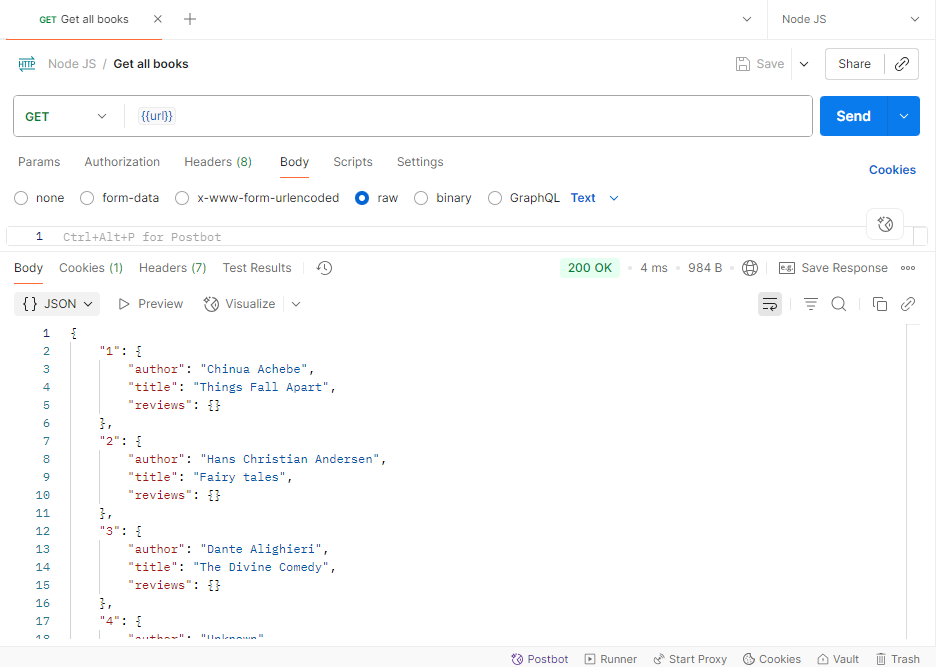
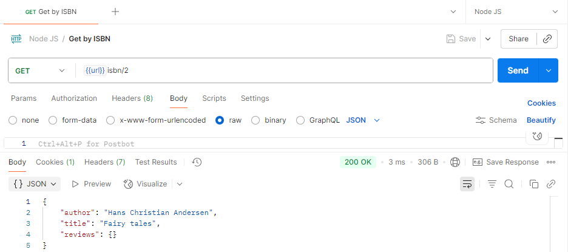
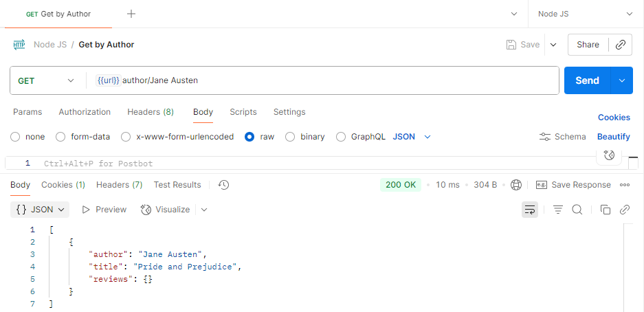
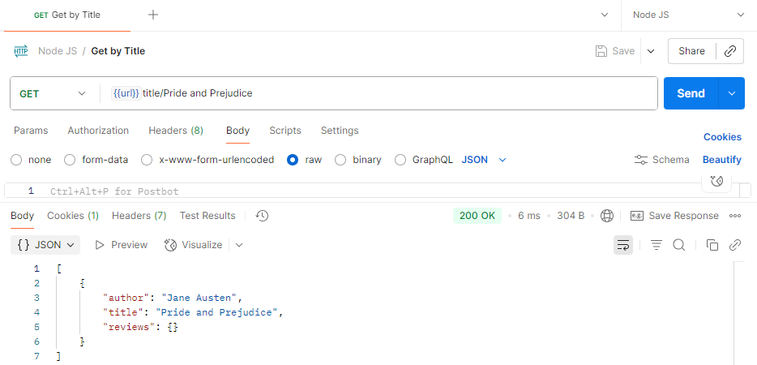
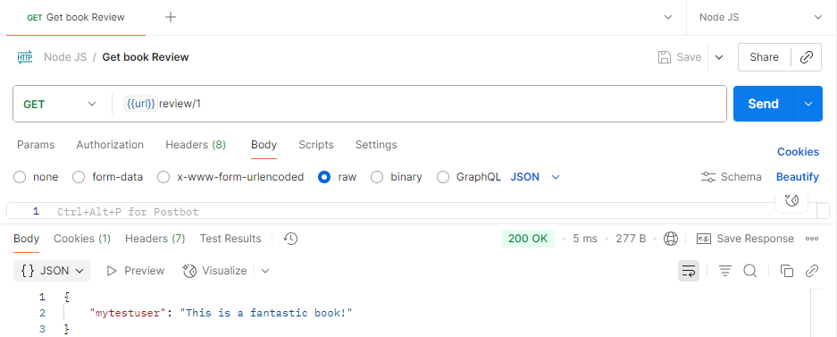
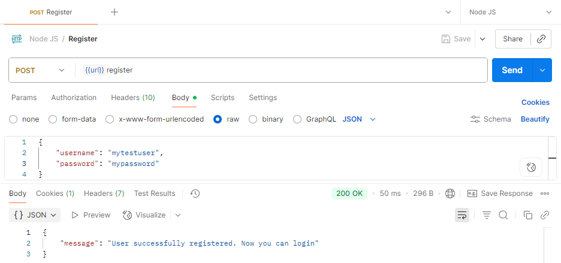
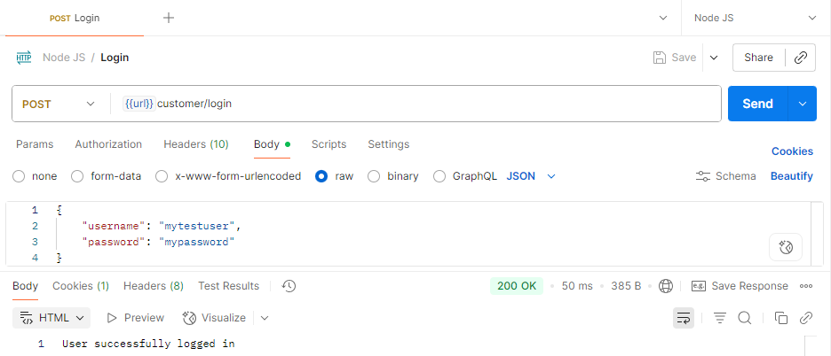
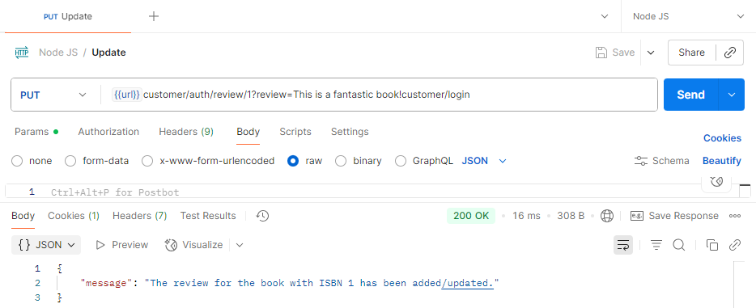
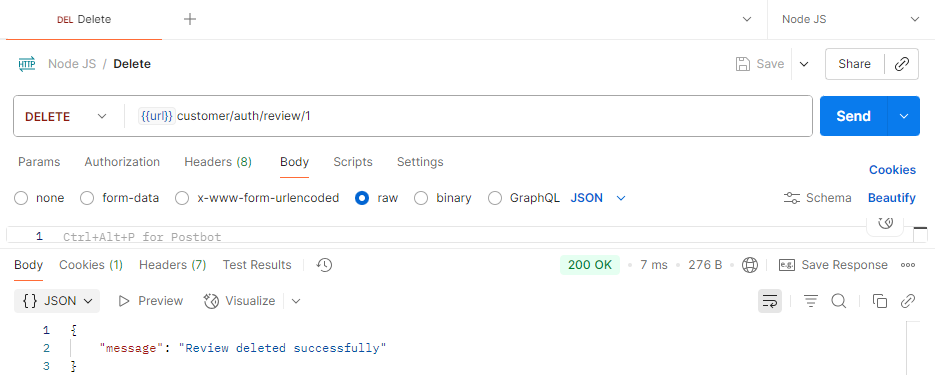

# Online Book Review API

This project is a back-end application for an online book retailer that stores, retrieves, and manages book ratings and reviews. It is developed using Node.js and Express.js and serves as a RESTful web service.

## Author

- **Muhammad Fraz**
  - GitHub: [213020aumc](https://github.com/213020aumc)
  - LinkedIn: [linkedin.com/in/muhammad-fraz](https://www.linkedin.com/in/muhammad-fraz-298900247)

---

## Project Features

- **General Users (Public Access):**
  - Retrieve a list of all available books.
  - Search for books by ISBN, Author, or Title.
  - Get all reviews for a specific book.
  - Register a new user account.
  - Log in to the application.
- **Registered Users (Authenticated Access):**
  - Add a new review for a book.
  - Modify their own book review.
  - Delete their own book review.

## Technologies Used

- Node.js
- Express.js
- JSON Web Tokens (JWT) for authentication
- Express Session for session management

## Setup and Installation

1.  **Clone the repository:**

    ```bash
    git clone https://github.com/213020aumc/my-book-review-app.git
    ```

2.  **Navigate to the project directory:**

    ```bash
    cd my-book-review-app
    ```

3.  **Install dependencies:**

    ```bash
    npm install
    ```

4.  **Start the server:**
    ```bash
    npm start
    ```
    The server will be running on `http://localhost:5000`.

## API Endpoints

All endpoints are relative to `http://localhost:5000`.

### General (Public) Endpoints

| Method | Endpoint          | Description                                                                     |
| :----- | :---------------- | :------------------------------------------------------------------------------ |
| `GET`  | `/`               | Get the list of all books.                                                      |
| `GET`  | `/isbn/:isbn`     | Get book details based on ISBN.                                                 |
| `GET`  | `/author/:author` | Get book details based on Author.                                               |
| `GET`  | `/title/:title`   | Get book details based on Title.                                                |
| `GET`  | `/review/:isbn`   | Get all reviews for a book based on ISBN.                                       |
| `POST` | `/register`       | Register a new user. **Body:** `{ "username": "user", "password": "pw" }`       |
| `POST` | `/customer/login` | Login for registered user. **Body:** `{ "username": "user", "password": "pw" }` |

### Authenticated Endpoints

These endpoints require the user to be logged in.

| Method   | Endpoint                                 | Description                                                                            |
| :------- | :--------------------------------------- | :------------------------------------------------------------------------------------- |
| `PUT`    | `/customer/auth/review/:isbn?review=...` | Add or modify a review for a book. The review text is passed as a URL query parameter. |
| `DELETE` | `/customer/auth/review/:isbn`            | Delete the logged-in user's review for a book.                                         |

---

## API Test Screenshots

Here are the results of testing the API endpoints using Postman.

### Task 1 & 10: Get all books



### Task 2 & 11: Get books by ISBN



### Task 3 & 12: Get books by Author



### Task 4 & 13: Get books by Title



### Task 5: Get book review



### Task 6: Register a new user



### Task 7: Login as a registered user



### Task 8: Add/Modify a book review



### Task 9: Delete a book review


